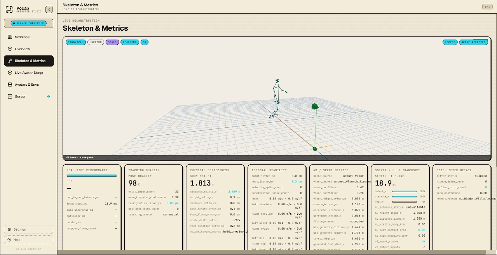
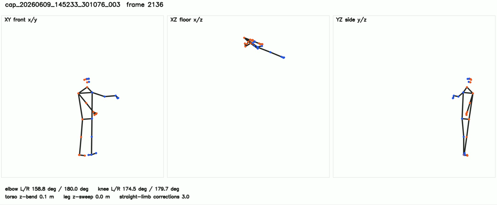
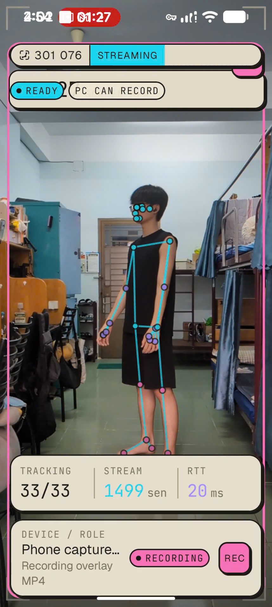
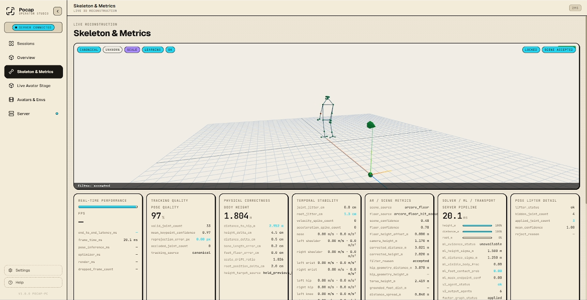
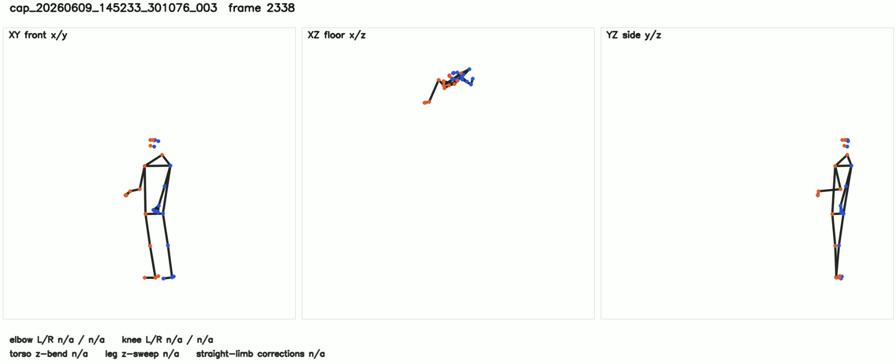
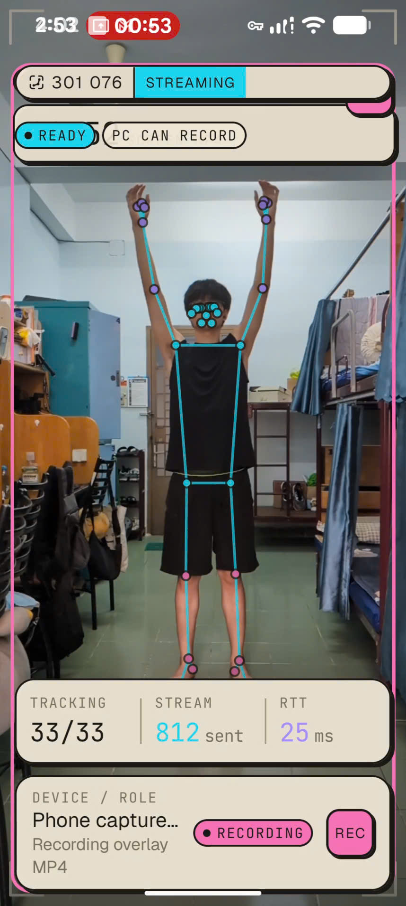
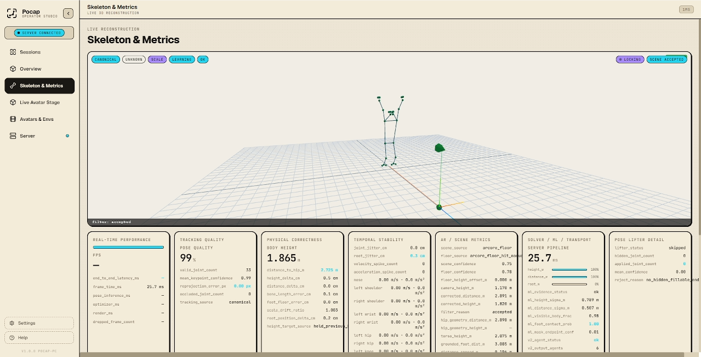
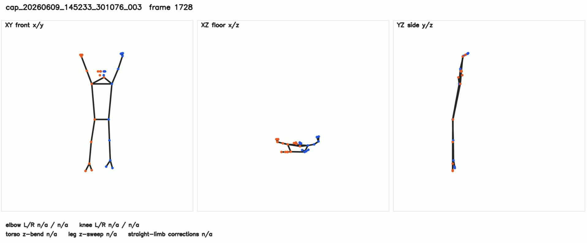

# Pocket Mocap Android (poandroid)

Pocket Mocap Android is the phone capture subsystem. It records camera-frame pose evidence, session metadata, and synchronized landmark packets for the PC reconstruction subsystem.

## System Role
- **Single phone mode:** one Android phone records 2D landmarks, camera metadata, scene evidence, and timestamps for one PC session.
- **Multi-phone mode:** multiple Android phones join the same PC session and send synchronized evidence streams for stronger 3D reconstruction.
- **Subsystem boundary:** `poandroid` owns capture and evidence transport; `popc` owns calibration, reconstruction, validation, replay, and artifact export.
- **ML stack:** both subsystems use a seven-model evidence stack: pose landmarking, hand landmarking, face landmarking, object/person segmentation, depth/metric evidence, temporal motion filtering, and pose-lifter/canonical reconstruction support.

## Capabilities
The Android app runs phone-side capture, pose landmark detection, capture review, synchronization, evidence packaging, and transport. It supports single-phone capture and multi-phone capture where several Android devices join one PC session.

## Capture Evidence
Source capture: `cap_20260609_145233_301076_003` from session `301076`.

Each pose section shows three different evidence types from `capture_evidence`:
- normal phone capture image;
- PC reconstructed 3D skeleton image;
- PC constructed view image with XY, XZ, and YZ review panels.

## Capture Evidence: T pose


T pose 2D phone capture.


T pose PC reconstructed 3D skeleton.


T pose PC constructed XY/XZ/YZ review view.

## Capture Evidence: A pose


A pose 2D phone capture.


A pose PC reconstructed 3D skeleton.


A pose PC constructed XY/XZ/YZ review view.

## Capture Evidence: 45 deg left


45 degree left 2D phone capture.



45 degree left PC reconstructed 3D skeleton.



45 degree left PC constructed XY/XZ/YZ review view.

## Capture Evidence: 45 deg right



45 degree right 2D phone capture.



45 degree right PC reconstructed 3D skeleton.



45 degree right PC constructed XY/XZ/YZ review view.

## Capture Evidence: Handraise pose



Handraise pose 2D phone capture.



Handraise pose PC reconstructed 3D skeleton.



Handraise pose PC constructed XY/XZ/YZ review view.

## Test
```powershell
cd D:\pocket-mocap\poandroid
.\gradlew.bat :app:testV2LabDebugUnitTest
```

## Build APK
```powershell
cd D:\pocket-mocap\poandroid
.\gradlew.bat :app:assembleV2LabDebug
```

The debug APK is written to `app/build/outputs/apk/v2Lab/debug/app-v2Lab-debug.apk`.

## APK Usage Flow
1. Download the Android APK from the project release assets or copy the built APK to the phone.
2. Open the APK on the Android device and allow installation from the selected source if Android asks.
3. Open Pocap Android after installation and grant the required camera/network permissions.
4. On the PC, open Pocap/POPC, create a session, and keep the session QR code or join details visible.
5. On the phone, scan the QR code from the PC session screen, or fill in the PC address/session code manually if scanning is unavailable.
6. Confirm the phone appears as a joined device in POPC and that the phone shows connected/capture-ready state.
7. For multi-phone capture, repeat the join process on each additional Android phone and verify every device card in POPC.
8. Follow calibration prompts when ChArUco calibration is required, then wait for POPC to mark calibration/readiness acceptable.
9. Start capture from POPC, perform the motion, stop capture, and review the reconstructed outputs on the PC.
