# Pocket Mocap Android (poandroid)

Pocket Mocap Android is the phone capture subsystem. It records camera-frame pose evidence, session metadata, and synchronized landmark packets for the PC reconstruction subsystem.

## System Role
- **Single phone mode:** one Android phone records 2D landmarks, camera metadata, scene evidence, and timestamps for one PC session.
- **Multi-phone mode:** multiple Android phones join the same PC session and send synchronized evidence streams for stronger 3D reconstruction.
- **Subsystem boundary:** `poandroid` owns capture and evidence transport; `popc` owns calibration, reconstruction, validation, replay, and artifact export.
- **ML stack:** both subsystems use a seven-model evidence stack: pose landmarking, hand landmarking, face landmarking, object/person segmentation, depth/metric evidence, temporal motion filtering, and pose-lifter/canonical reconstruction support.

## Capabilities
The Android app runs phone-side capture, pose landmark detection, capture review, synchronization, evidence packaging, and transport. It supports single-phone capture and multi-phone capture where several Android devices join one PC session.

## Capture Evidence
Source capture: `cap_20260609_145233_301076_003` from session `301076`.

Each section shows the same pose as three reconstruction views:
- **XY front x/y:** front body silhouette and left/right layout.
- **XZ floor x/z:** depth and floor-plane body orientation.
- **YZ side y/z:** upright body line, depth branch, and limb straightness.

## Capture Evidence: T pose

| XY front x/y | XZ floor x/z | YZ side y/z |
| --- | --- | --- |
| 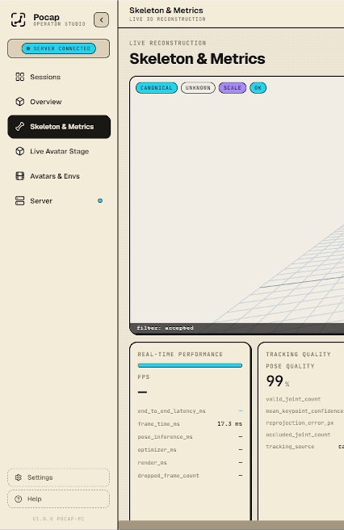 | 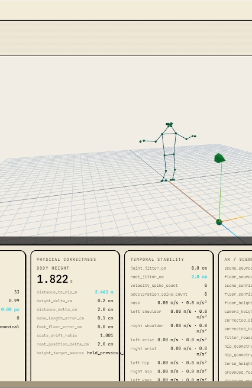 | 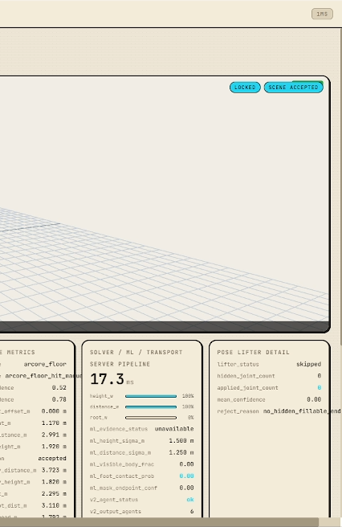 |

Standing T-pose evidence. The front view checks arm spread and shoulder alignment, the floor view checks depth symmetry, and the side view checks upright posture.

## Capture Evidence: A pose (back view)

| XY front x/y | XZ floor x/z | YZ side y/z |
| --- | --- | --- |
| 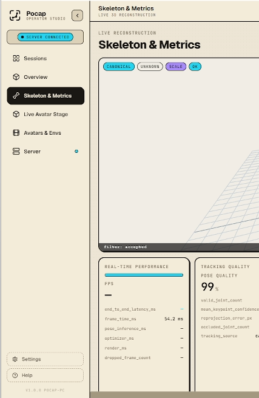 | 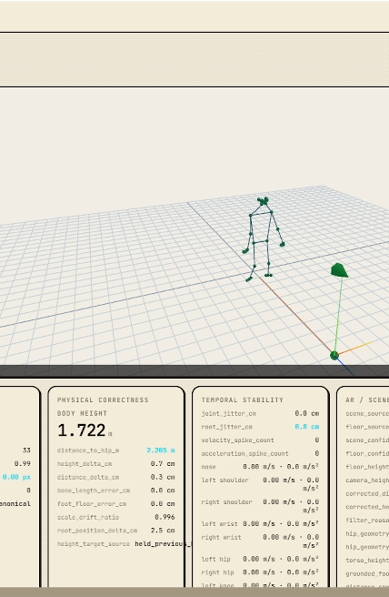 | 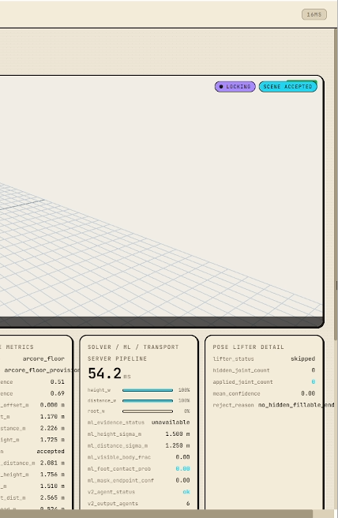 |

Relaxed A-pose evidence from the back. The views verify arms hang downward, legs remain straight, and the torso stays upright through depth.

## Capture Evidence: 45 deg left

| XY front x/y | XZ floor x/z | YZ side y/z |
| --- | --- | --- |
| 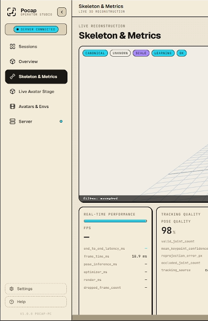 | 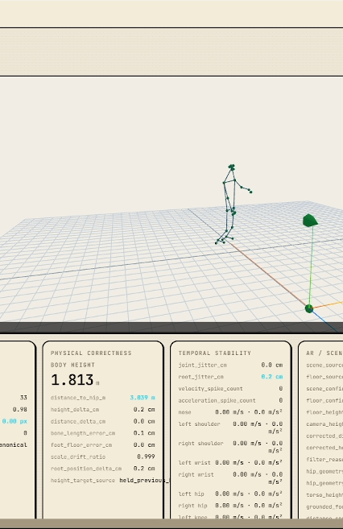 | 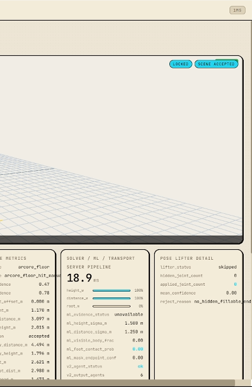 |

Left-turn evidence. The views show front silhouette, floor-plane rotation, and side-plane body line for the same capture frame family.

## Capture Evidence: 45 deg right

| XY front x/y | XZ floor x/z | YZ side y/z |
| --- | --- | --- |
| 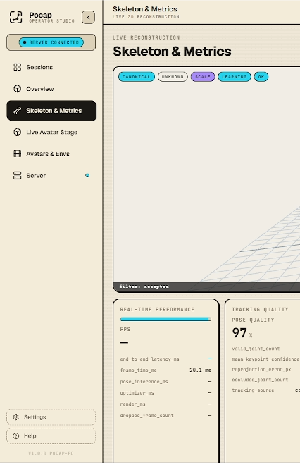 | 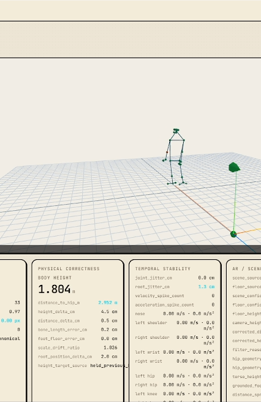 | 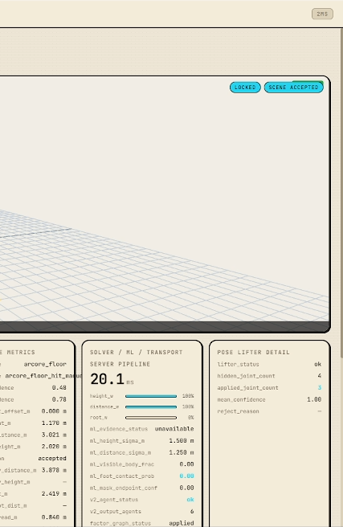 |

Right-turn evidence. The views verify that yaw is represented as body rotation without collapsing shoulders, hips, or legs.

## Capture Evidence: Handraise pose

| XY front x/y | XZ floor x/z | YZ side y/z |
| --- | --- | --- |
| 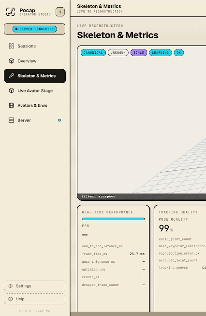 | 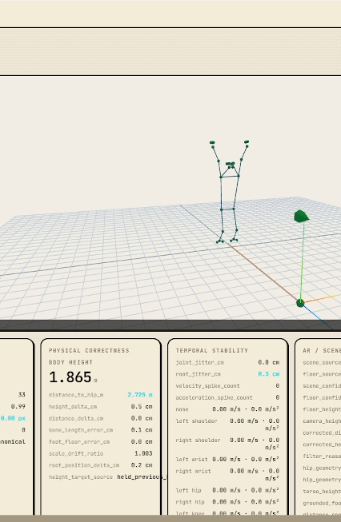 | 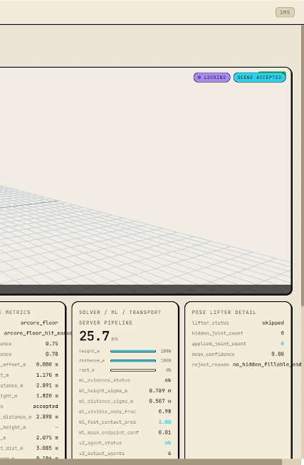 |

Raised-hand evidence. The views check hand height, head-relative depth, and torso stability while the arm is lifted.

## Build
```powershell
cd D:\pocket-mocap\poandroid
.\gradlew.bat :app:assembleV2LabDebug
```

## Test
```powershell
cd D:\pocket-mocap\poandroid
.\gradlew.bat :app:testV2LabDebugUnitTest
```
