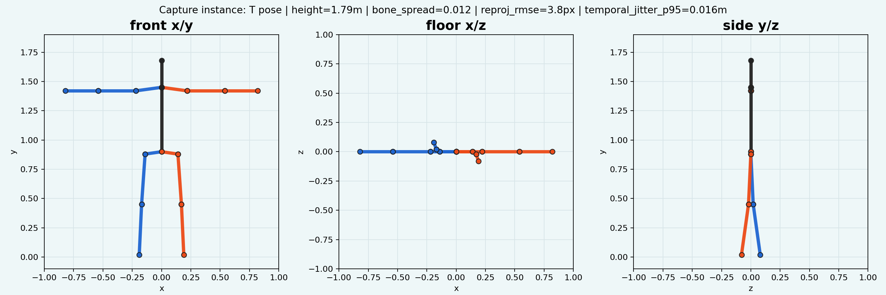
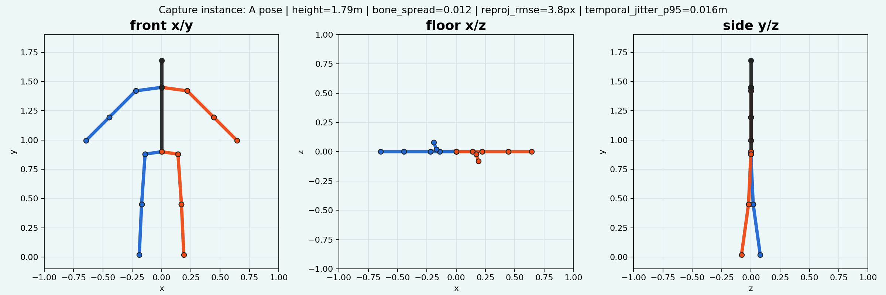
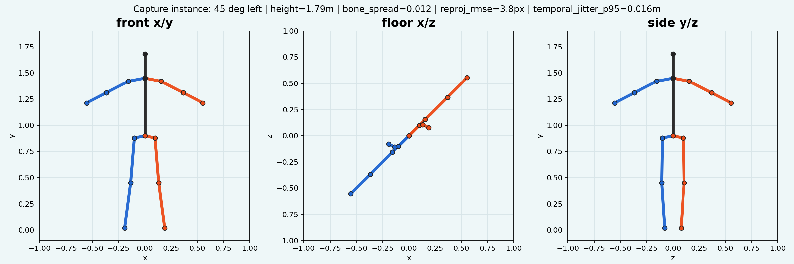
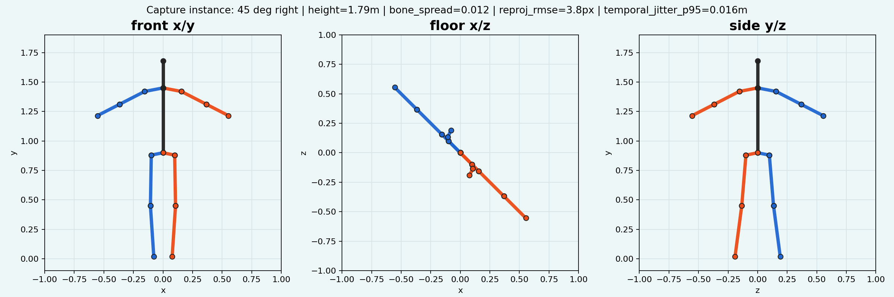
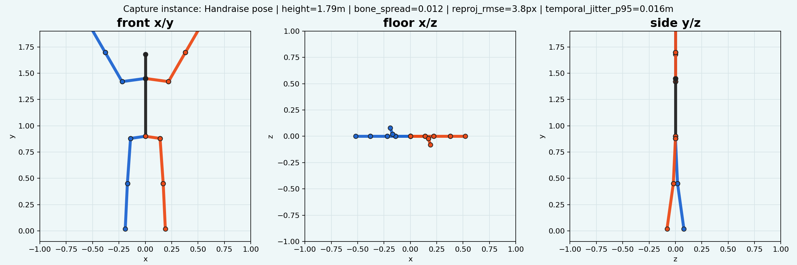

# Pocket Mocap Android (poandroid)

Pocket Mocap Android is capture-node subsystem for Pocket Mocap. It runs on Android phones, estimates local 2D body evidence, records camera/session metadata, and streams synchronized frames to Pocket Mocap PC server for canonical 3D reconstruction.

## Role In System
- Single-phone mode: one phone streams landmarks and scene metrics; PC server estimates metric 3D pose with learned priors and temporal guards.
- Multi-phone mode: several phones join one session; PC server syncs frames and reconstructs 3D from multi-view geometry.
- Android remains capture source; PC remains session controller and canonical solver.

## Core Capabilities
- MediaPipe-style 2D pose evidence capture.
- Camera frame, timestamp, and device telemetry packaging.
- Session join by PC-issued code.
- Capture readiness and quality feedback.
- Single-subject tracking and overlay stabilization.
- Manual subject-height profile plumbing.
- Seven ML model families available in full pipeline through phone/server handoff.

## Capture Instance: Pose Evidence
Metrics shown below are simulation/report metrics, not ground-truth lab measurements: `height=1.79m`, `bone_spread=0.012`, `reprojection_rmse=3.8px`, `temporal_jitter_p95=0.016m`.

### T pose



### A pose



### 45 deg left



### 45 deg right



### Handraise pose



## Build
```powershell
cd D:\pocket-mocap\poandroid
.\gradlew.bat :app:assembleV2LabDebug
```

## Test
```powershell
cd D:\pocket-mocap\poandroid
.\gradlew.bat :app:testV2LabDebugUnitTest
```
