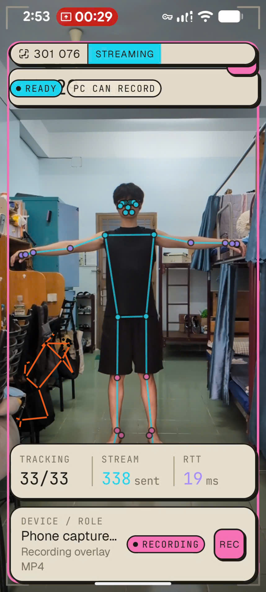
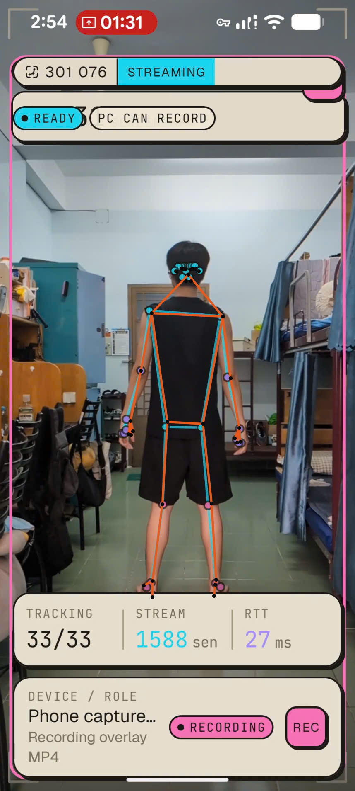
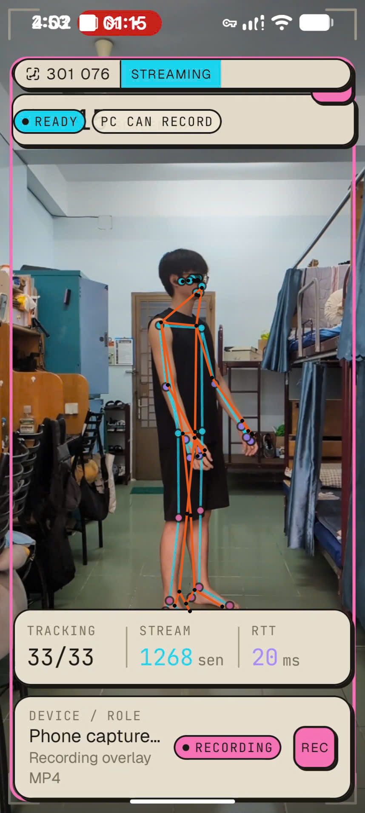
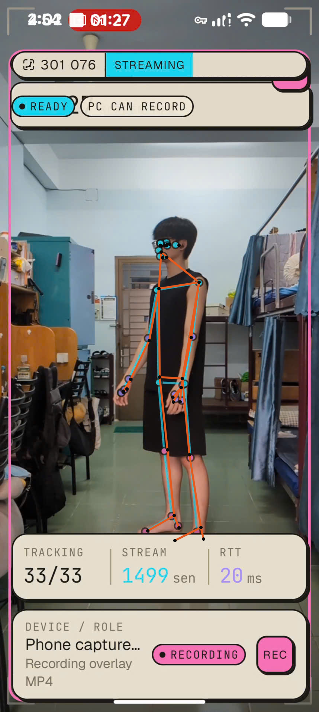
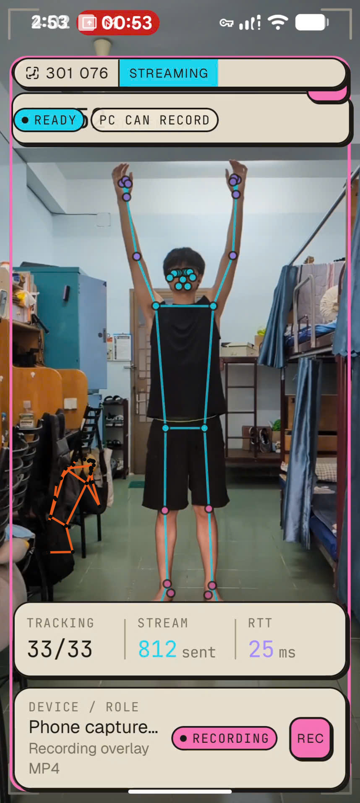

# Pocket Mocap Android (poandroid)

Pocket Mocap Android is the phone capture subsystem. It records camera-frame pose evidence, session metadata, and synchronized landmark packets for the PC reconstruction subsystem.

## System Role
- **Single phone mode:** one Android phone records 2D landmarks, camera metadata, scene evidence, and timestamps for one PC session.
- **Multi-phone mode:** multiple Android phones join the same PC session and send synchronized evidence streams for stronger 3D reconstruction.
- **Subsystem boundary:** `poandroid` owns capture and evidence transport; `popc` owns calibration, reconstruction, validation, replay, and artifact export.
- **ML stack:** both subsystems are organized around the seven-model evidence stack: pose landmarking, hand landmarking, face landmarking, object/person segmentation, depth/metric evidence, temporal motion filtering, and pose-lifter/canonical reconstruction support.

## Capabilities
The Android app runs phone-side capture, pose landmark detection, capture review, synchronization, evidence packaging, and transport. It supports single-phone capture and multi-phone capture where several Android devices join one PC session.

## Capture Evidence: Session 301076
Source session: `C:\Users\Asus\Documents\Pocap\sessions\301076`.
Source capture: `cap_20260609_145233_301076_003`.

Each pose subsection uses exactly three real capture-evidence views from the same pose family:
1. phone camera evidence;
2. phone 2D landmark evidence;
3. PC reconstructed 3D evidence.

### T pose





### A pose (back view)





### 45 deg left





### 45 deg right





### Handraise pose





## Build
```powershell
cd D:\pocket-mocap\poandroid
.\gradlew.bat :app:assembleV2LabDebug
```

## Test
```powershell
cd D:\pocket-mocap\poandroid
.\gradlew.bat :app:testV2LabDebugUnitTest
```
